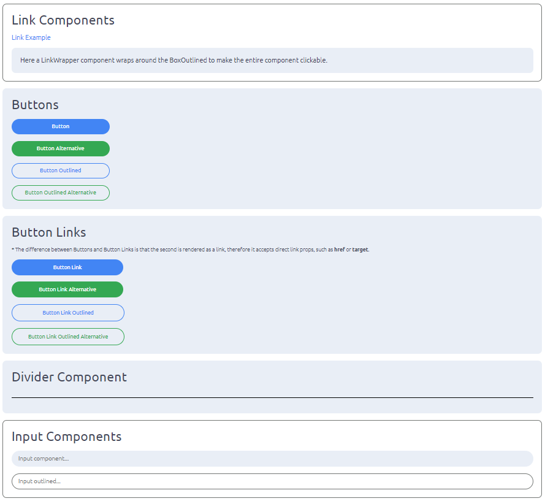

<h1 style="text-align: center; margin: 10px;">Welcome to Llane UI</h1>

Llanne UI is an open-source project, ready-to-use React.js components library that facilitates the development of React.js frontend applications and websites, natively compatible with mobile device screens and dark/light themes. The idea of developing a standard UI framework for React.js and TypeScript comes from my own need for standardising UI components across different applications for a onsistent cross-platform UI/UX and an efficient way to update multiple frontend UIs all at once. The library is conceived in a way that desktop browser applications should be automatically compatible with mobile view, without any need for refactoring or working with different components for different screen sizes.

**Live Components Demo on Netlify:** https://main--capable-dragon-152070.netlify.app/

> [!WARNING]
> **Ongoing Development:** This is an ongoing project with heavy development underway. Contributions are welcomed and more documentation will be uploaded as the project develops.
- [Install Llane UI](#install-llane-ui)
- [Build Llane UI](#build-llane-ui)
- [Testing Llane UI](#testing-llane-ui)
- [Building Test Application](#building-test-application)
- [How to use it with my React App?](#how-to-use-it-with-my-react-app)
  - [Regular Usage With NPM](#regular-usage-with-npm)
  - [Fetch From GitHub (Unstable)](#fetch-from-github-unstable)
  - [Using Llane UI](#using-llane-ui)
- [How do I build a custom icon library?](#how-do-i-build-a-custom-icon-library)
- [Components List (A-Z)](#components-list-a-z)




## Install Llane UI

You can install LLane UI by running:
```shell
npm install
```

## Build Llane UI

> [!NOTE]
> If you have already built Llane UI and wants to rebuild it, you will need to use the commands `npm run rebuild-unix` if you are on Linux or macOS or `npm run rebuild-windows` if you are on Windows.

You can build Llane UI by running the following command:
```shell
npm run build
```

This will compile Llane UI to your `/dist` folder, which will then be used by your application to import the Llane UI components.

## Testing Llane UI

You can run the test TSX page by using the following command:
```shell
npm run test
```

This will open a test page in your `localhost` with all the available components rendered. You can use this to make modifications to the components and test them in real-time.

## Building Test Application

You can also crete an optimised build of the test application - even though I'm not sure why you would 🤷 - by running the following command:
```shell
npm run deploy-test-app
```

This should create an optimised build in your `/build` folder.

## How to use it with my React App?

### Regular Usage With NPM

You can use `npm` to install the latest stable release of `llane-ui` dependency in your React App:
```shell
npm install llane-ui --save-dev
```

### Fetch From GitHub (Unstable)
You can add the latest unstable version of Llane UI to your React App dependency tree by adding the following line to your `package.json` file (under dependencies):

```json
"llane-ui": "git+https://github.com/znx-x/llane-ui.git"
```

This will import and build Llane UI with your application. **Only use this method in non-production applications and be aware of the risks (including breaking risks) inherent from these unstable versions.**

### Using Llane UI

After installing it, you can use Llane UI components by importing and declaring them in your `JSX` or `TSX`. For exaple:

```js
import { Heading } from 'llane-ui';

/* Your Code */

return(
    <>
      <Heading>
        This is a Llane UI Heading.
      </Heading>
    </>
)
```

## How do I build a custom icon library?

> [!NOTE]
> You will need to have **[Python](https://www.python.org/downloads/)** installed to build your custom icon library.

By default, LLane UI uses a pre-compiled set of **[react-feather](https://feathericons.com/)** icons with some additions, but you can add, remove, or customise the icon library with your own `.svg` files. Follow the steps below to build your custom icon library:

1. Add, remove, and customise your `.svg` files inside the `/src/Icons/library` folder. You will need to adhere to the Kebab-Case naming convention when naming or renaming your files. Alternatively, you can adjust the `build-icon-library.py` script to fit your naming style if you prefer not to use Kebab-Case.
2. Inside the root folder, execute the `build-icon-library.py` script to build your library:
    ```shell
    python build-icon-library.py
    ```
3. Now, you will need to rebuild the LLane UI framework to compile the new library and incorporate the new export structure:
    ```shell
    npm run build
    ```

This process will update the `/dist` folder, creating all the new icons and a new export structure that you can use in your project.

## Components List (A-Z)

Full list of supported components. Each component might have their own custom props and I will provide detailed explanation on each one when the full documentation for the project is published.

- **Box**
- ✅ **Button:** `Button` `ButtonAlt` `ButtonOutlined` `ButtonOutlinedAlt`
- ✅ **Container:** `Container`
- ✅ **Divider:** `Divider`
- **Dropdown**
- ✅ **FlexContainer:** `FlexContainer`
- **Footer**
- ✅ **GridContainer:** `GridContainer`
- 🟡**Header:** `Header` `HeaderContainer` `HeaderSection` `HeaderLink`
- ✅ **Icons**
- ✅ **Image:** `Image`
- ✅ **Input:** `Input` `InputOutlined`
- ✅ **Link:** `Link` `LinkWrapper`
- ✅ **Typography:** `HeadingExtraLarge` `HeadingLarge` `Heading` `HeadingSmall` `HeadingExtraSmall` `HeadingTiny` `TextExtraLarge` `TextLarge` `Text` `TextSmall` `TextExtraSmall` `TextDimmed`
- ✅ **Spacer:** `Spacer` `Sp`
- ✅ **Span:** `Span`
- ✅ **TextArea:** `TextArea` `TextAreaOutlined`
- ✅ **Toggle:** `ThemeToggleButton` `ToggleButton`
- ✅ **Wrapper:** `AppWrapper` `PageWrapper`

